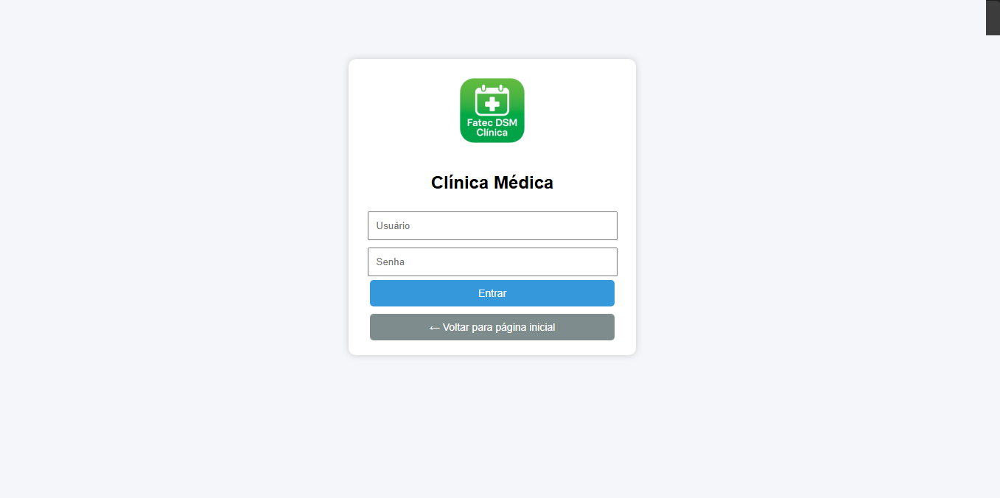
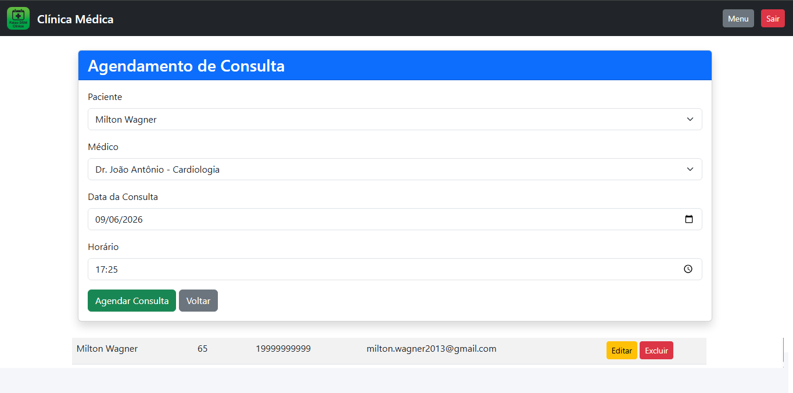
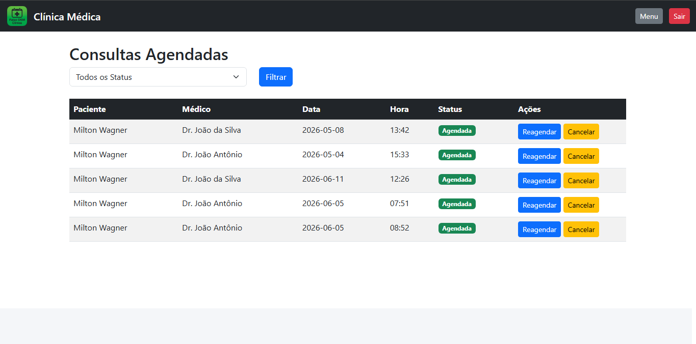
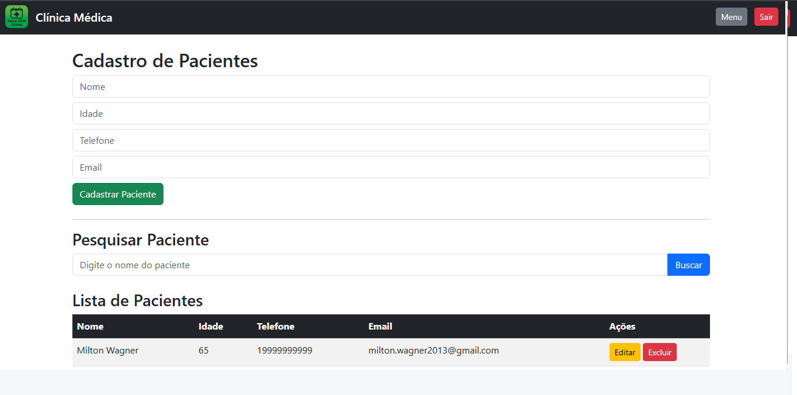
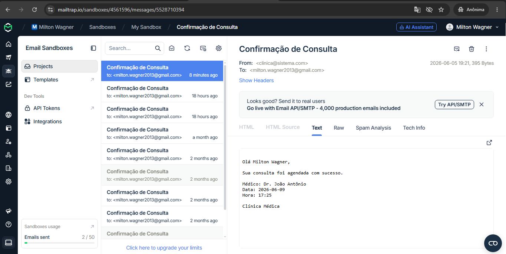

# 📸 Imagens do Sistema

## 🏠 Tela Inicial


## 🔐 Tela de Login


## 📋 Menu Principal


## 📅 Agendamento de Consulta


## 📊 Lista de Consultas


## 👤 Cadastro de Pacientes


## 📧 Confirmação de Email



# 🏥 Sistema de Gestão de Clínica Médica (SGHSS)

## 👨‍💻 Grupo de Projeto Integrador (PI)

* Adriel Rattes Cortez
* Fernando Dias Araujo
* Giuliano Oliveira da Silva
* Milton Wagner Filho
* Paulo Ricardo de Camargo
* Riquelme Eduardo Previtale Gomes

---

# 📌 Visão Geral do Projeto

Este projeto apresenta o desenvolvimento de um Sistema Web para Gestão de Clínica Médica, 
concebido com base em princípios sólidos de engenharia de software, arquitetura em camadas 
e boas práticas de desenvolvimento.

O sistema foi projetado para simular um ambiente real de clínica médica, contemplando desde 
o cadastro de pacientes até o gerenciamento completo de consultas, incluindo notificações 
automatizadas.

---

# 🎯 Objetivo Acadêmico e Técnico

O objetivo deste projeto é consolidar conhecimentos nas seguintes áreas:

* Desenvolvimento Web com Python
* Arquitetura MVC
* Persistência de dados com ORM
* Boas práticas de organização de código
* Integração de serviços externos (email)

Além disso, busca-se entregar uma aplicação funcional com características próximas a 
sistemas utilizados no mercado.

---

# 🧱 Stack Tecnológica

| Tecnologia | Finalidade                           |
| ---------- | ------------------------------------ |
| Python     | Linguagem principal                  |
| Flask      | Framework web leve e modular         |
| SQLAlchemy | ORM para abstração do banco de dados |
| SQLite     | Banco de dados relacional            |
| Bootstrap  | Padronização visual e responsividade |
| HTML / CSS | Estrutura e estilização              |
| Jinja2     | Template engine                      |
| Git        | Versionamento de código              |

---

# 🏗️ Arquitetura e Organização

O sistema foi estruturado seguindo o padrão **MVC (Model-View-Controller)**, garantindo:

* Separação de responsabilidades
* Manutenibilidade
* Escalabilidade

### 📂 Organização do Projeto

* `models/` → definição das entidades e regras de persistência
* `controllers/` → lógica de negócio e controle de rotas
* `templates/` → camada de apresentação (Jinja2)
* `static/` → arquivos estáticos (CSS, imagens)
* `utils/` → serviços auxiliares (email e lembretes)

### 🗂 Estrutura Completa do Projeto

## 📂 Estrutura do Projeto

```text
ProjetoClinicaMedica/
│
├── app.py
├── extensions.py
├── README.md
├── .gitignore
│
├── controllers/
│   ├── __init__.py
│   ├── paciente_controller.py
│   └── consulta_controller.py
│
├── models/
│   ├── __init__.py
│   ├── paciente.py
│   ├── medico.py
│   └── consulta.py
│
├── instance/
│   └── db.sqlite3
│
├── database/
│
├── templates/
│   ├── base.html
│   ├── home.html
│   ├── index.html
│   ├── login.html
│   ├── menu.html
│   ├── pacientes.html
│   ├── editar_paciente.html
│   ├── consultas.html
│   ├── agendar.html
│   ├── reagendar.html
│   ├── cadastrar.html
│   ├── editar.html
│   │
│   └── erros/
│       ├── 404.html
│       └── 500.html
│
├── static/
│   ├── css/
│   │   └── style.css
│   │
│   └── img/
│       ├── agendar.png
│       ├── clinica.jpg
│       ├── consultas.png
│       ├── email.png
│       ├── home.png
│       ├── login.png
│       ├── logo.jpg
│       ├── menu.png
│       └── pacientes.png
│
└── utils/
    ├── email_service.py
    └── lembrete.py
```

## 📁 Descrição das Pastas

### 📌 controllers/

Responsável pelo controle das rotas e regras de negócio da aplicação.

Arquivos:

- paciente_controller.py
- consulta_controller.py

---

### 📌 models/

Contém as entidades do sistema e o mapeamento ORM realizado pelo SQLAlchemy.

Entidades:

- Paciente
- Médico
- Consulta

---

### 📌 templates/

Contém todas as páginas HTML desenvolvidas utilizando Jinja2.

Principais telas:

- Página inicial
- Login
- Menu principal
- Cadastro de pacientes
- Edição de pacientes
- Agendamento de consultas
- Reagendamento de consultas
- Listagem de consultas

Também contém páginas de tratamento de erros:

- 404.html
- 500.html

---

### 📌 static/

Arquivos estáticos utilizados pelo sistema.

Inclui:

- Folhas de estilo CSS
- Logotipo da clínica
- Capturas de tela utilizadas na documentação

---

### 📌 utils/

Serviços auxiliares utilizados pela aplicação.

Arquivos:

- email_service.py → responsável pelo envio de emails.
- lembrete.py → responsável pelo envio de lembretes automáticos.

---

### 📌 instance/

Contém o banco de dados SQLite utilizado pelo sistema.

Arquivo:

- db.sqlite3

---

### 📌 app.py

Arquivo principal da aplicação Flask.

Responsável por:

- Inicialização do sistema
- Registro dos Blueprints
- Configuração do banco de dados
- Configuração das rotas principais
- Tratamento de erros

---

### 📌 extensions.py

Arquivo responsável pela configuração e inicialização do SQLAlchemy.


# ⚙️ Funcionalidades Implementadas

## 🔐 Autenticação
- Sistema de login com controle de sessão
- Proteção de rotas

## 🧑‍⚕️ Gestão de Pacientes
- Cadastro de pacientes
- Edição de pacientes
- Exclusão de pacientes
- Pesquisa por nome
- Listagem dinâmica

## 👨‍⚕️ Gestão de Médicos
- Cadastro automático de médicos na inicialização do sistema
- Associação de especialidades médicas
- Utilização nas rotinas de agendamento de consultas

## 📅 Agendamento de Consultas
- Seleção de paciente
- Seleção de médico com especialidade
- Escolha de data e hora
- Interface com lista dinâmica e scroll

## 📋 Painel de Consultas

- Visualização estruturada
- Relacionamento paciente ↔ médico
- Filtro por status
- Cancelamento de consultas
- Reagendamento de consultas

## 🔗 Relacionamentos (ORM)
- Uso de `ForeignKey`
- Uso de `relationship`
- Navegação entre objetos (consulta.paciente, consulta.medico)

## 📧 Notificações por Email
- Integração com Mailtrap
- Envio de confirmação de consulta

## ⏰ Lembretes Automatizados
- Verificação de consultas futuras
- Disparo automático de notificações

## ⚠ Tratamento de Erros
O sistema possui páginas personalizadas para:
- Erro 404 (Página não encontrada)
- Erro 500 (Erro interno do servidor)

Arquivos:
templates/errors/404.html
templates/errors/500.html
---

# 📋 Requisitos Atendidos

| Requisito | Status |
|------------|---------|
| Login e Sessões | ✅ |
| CRUD de Pacientes | ✅ |
| Busca de Pacientes | ✅ |
| CRUD de Consultas | ✅ |
| Filtro de Consultas | ✅ |
| Cancelamento e Reagendamento | ✅ |
| SQLAlchemy ORM | ✅ |
| SQLite | ✅ |
| Arquitetura MVC | ✅ |
| Bootstrap | ✅ |
| Templates Jinja2 | ✅ |
| Relacionamentos ORM | ✅ |
| Envio de E-mail | ✅ |
| Lembretes Automáticos | ✅ |
| Tratamento de Erros 404 e 500 | ✅ |

---
# 📦 Dependências do Projeto

Instalação automática:

```bash
pip install -r requirements.txt
```

Principais dependências:

- Flask
- Flask-SQLAlchemy
- SQLite
- Bootstrap


# 🚀 Execução do Projeto

## Instalação
```bash
pip install flask flask_sqlalchemy
````

## Execução

```bash
python app.py
```

## Acesso

```
http://127.0.0.1:5000
```

---

# 🔐 Credenciais de Acesso

Usuário: `admin`
Senha: `123`

---

# 📧 Configuração de Email (Mailtrap)

Para ativar o envio de e-mails:

1. Criar conta no Mailtrap
2. Obter credenciais SMTP
3. Configurar em:

```
utils/email_service.py
```

---

# 📈 Avaliação Técnica do Projeto

O sistema demonstra:

* Uso correto de ORM (SQLAlchemy)
* Aplicação de arquitetura MVC
* Organização modular
* Separação clara de responsabilidades
* Integração com serviços externos

Trata-se de uma implementação consistente para nível acadêmico, com aproximação de 
práticas reais de mercado.

# 🔮 Melhorias Futuras

- Cadastro de usuários no banco de dados
- Controle de permissões por perfil
- Paginação de registros
- Relatórios em PDF
- Dashboard com indicadores
- Integração com APIs de calendário

---


